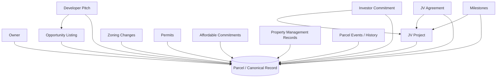

# Parcel-Centric Architecture (AnchorPlot)

## Core Principle

AnchorPlot is designed so the **parcel is the canonical primary record**.

- Not the user
- Not the project
- Not the transaction

All critical workflows are expected to carry `parcelId` and attach history to parcel intelligence records.

## Canonical Data Model

- `parcels/{parcelId}`: canonical property intelligence record
- `parcelEvents/*`: immutable-like timeline of parcel-linked events
- `listings/*`: must include `parcelId`
- `pitches/*`: must include `parcelId`
- `projects/*`: must include `parcelId`
- `investments/*`: must include `parcelId`
- `funding/*`: must include `parcelId`
- `zoningAlerts/*`: includes `parcelId` for impact tracking

## Relationship Diagram

## Parcel Intelligence Service

Frontend service: `frontend/src/services/parcelIntelligenceService.js`

Key methods:

- `getParcelLifecycle(parcelId)`
- `getParcelTimeline(parcelId, maxCount)`
- `appendParcelHistory(parcelId, eventType, payload, actorId)`
- `updateCanonicalParcel(parcelId, updates)`

Underlying snapshot helper in `frontend/src/services/firestoreService.js`:

- `getParcelIntelligenceSnapshot(parcelId)`

## Enforcement

Security rules in `firebase/firestore.rules` enforce `parcelId` on creation for:

- listings
- pitches
- projects
- investments
- funding
- parcelEvents

This ensures the full life-of-property view can be reconstructed from one parcel-centric timeline.
